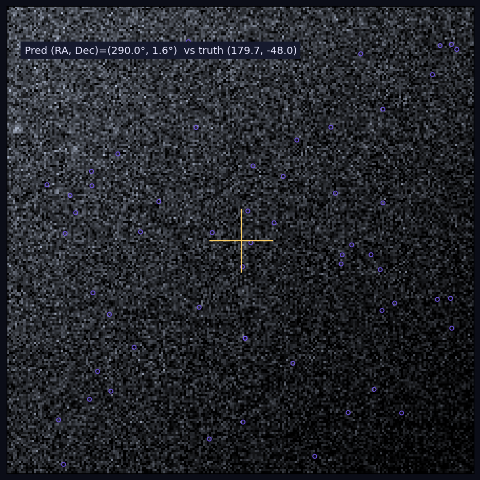
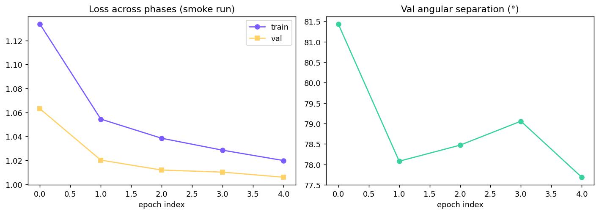

A research project that builds the full pipeline for end-to-end neural
**plate solving** — predicting sky coordinates (RA, Dec, rotation, field
width) from a single night-sky image — and reports the results honestly,
including where the model fails.

## The honest result

| Run | Train samples | Best val angular sep | Within 5° |
|---|---:|---:|---:|
| Fast preset | 5,000 | 65.6° | 1.7% |
| Standard (sin/cos) | 20,000 | 76.6° | 0.2% |

A random predictor on the sphere averages ~90°; the model reaches ~65–77°
— **barely better than random**. The write-up explains exactly why:
ImageNet features don't transfer to star fields, 20K synthetic samples
isn't enough for a 5M-parameter model, and plate solving is fundamentally a
*geometric matching* problem, not a feature-learning one.

## The engineering that's genuinely right

**sin/cos parameterization.** An earlier version regressed raw angles and
converged glacially — the loss never pushed predictions back into valid
range. Switching to `(sin, cos)` pairs decoded via `atan2` removes the wrap
discontinuity and smooths the loss landscape (the standard fix for spherical
and pose regression).

**Synthetic data pipeline.** Unlimited star fields rendered from the HYG
catalog via gnomonic projection, with magnitude-weighted PSFs, Poisson +
readout noise, and full-rotation augmentation (the night sky has no
canonical orientation).

## The baseline that works

The repo also ships a teaching-grade **classical triangle-hash solver** —
the same asterism-matching approach Astrometry.net uses — as the working
baseline the ML model is honestly measured against.

**Stack:** PyTorch · EfficientNet-B0 · OpenCV · NumPy · gnomonic projection
