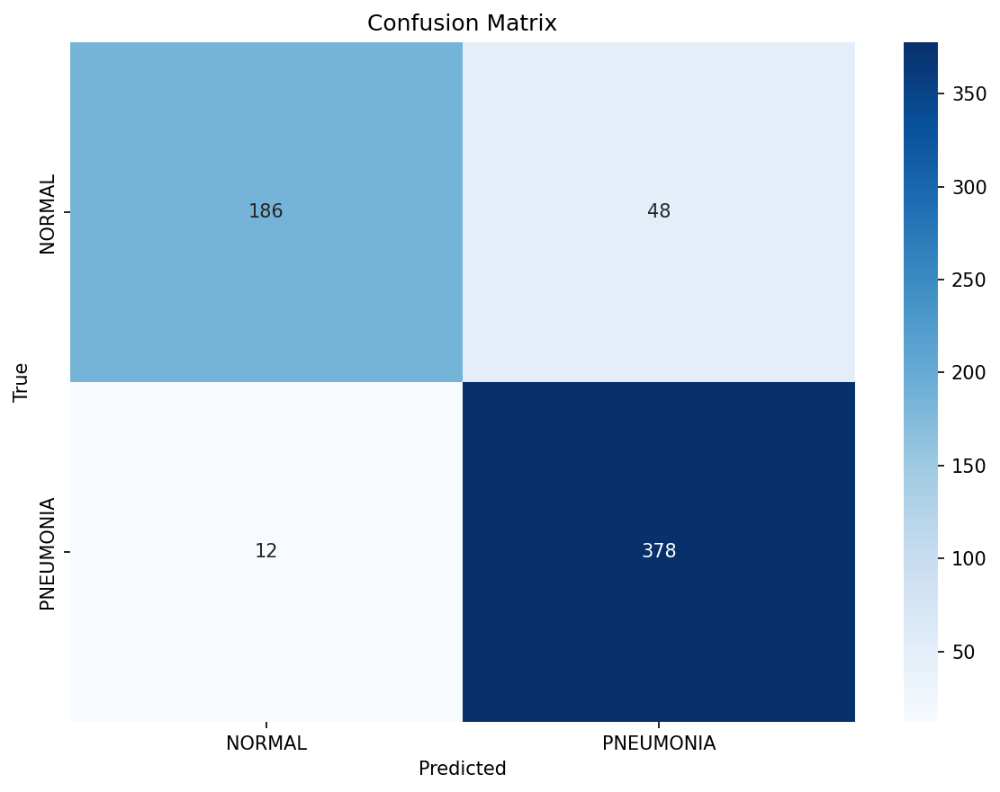
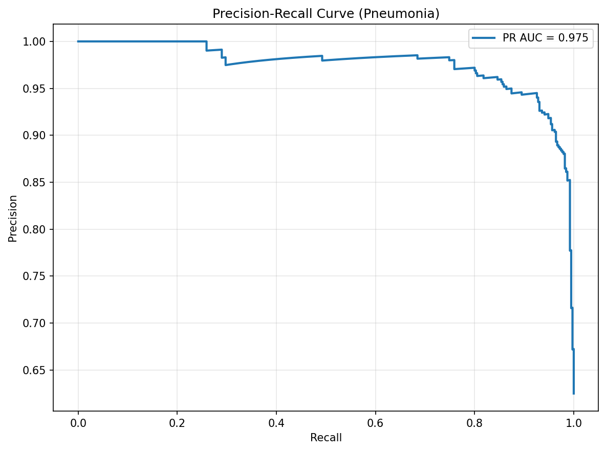

A deep-learning project that classifies chest X-rays as **Normal** or
**Pneumonia** with a ResNet50 transfer-learning model — and, just as
importantly, explains *why* through side-by-side Grad-CAM and Eigen-CAM
heatmaps.

> For research and education only. Not validated or intended for clinical
> diagnosis.

## Results

Evaluated on the official Kaggle test split:

| Metric | Value |
|---|---:|
| Test Accuracy | **90.4%** |
| ROC-AUC | **96.5%** |
| PR-AUC | **97.5%** |
| Pneumonia Recall | **96.9%** |
| Pneumonia F1 | **92.7%** |

Pneumonia screening is a **high-recall** task — a missed case is worse than
a false alarm — so the model is deliberately tuned to catch 96.9% of
pneumonia cases, accepting a higher false-positive rate on Normal images
as the tradeoff.

## Explainability — does it look at the lungs?

Each comparison shows the original X-ray, a Grad-CAM overlay (gradient-based
class evidence), and an Eigen-CAM overlay (dominant activation component).
Showing both checks whether the model focuses on plausible lung regions
rather than borders, labels, or artifacts.

## Ranking under class imbalance

The project also ships a documented **failure-case analysis** (the 12 false
negatives and 48 false positives) — the most important examples to inspect
in medical AI, since they reveal where the model is unreliable.

**Stack:** PyTorch · torchvision · pytorch-grad-cam · scikit-learn · Gradio demo
