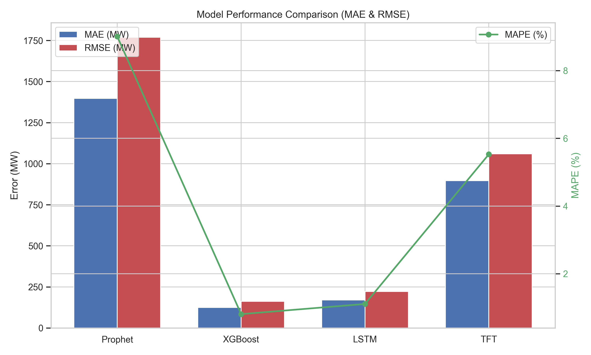
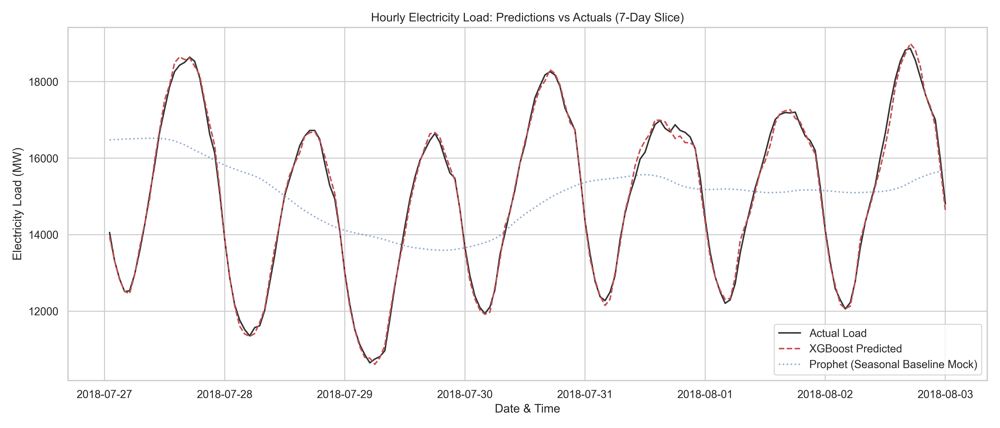
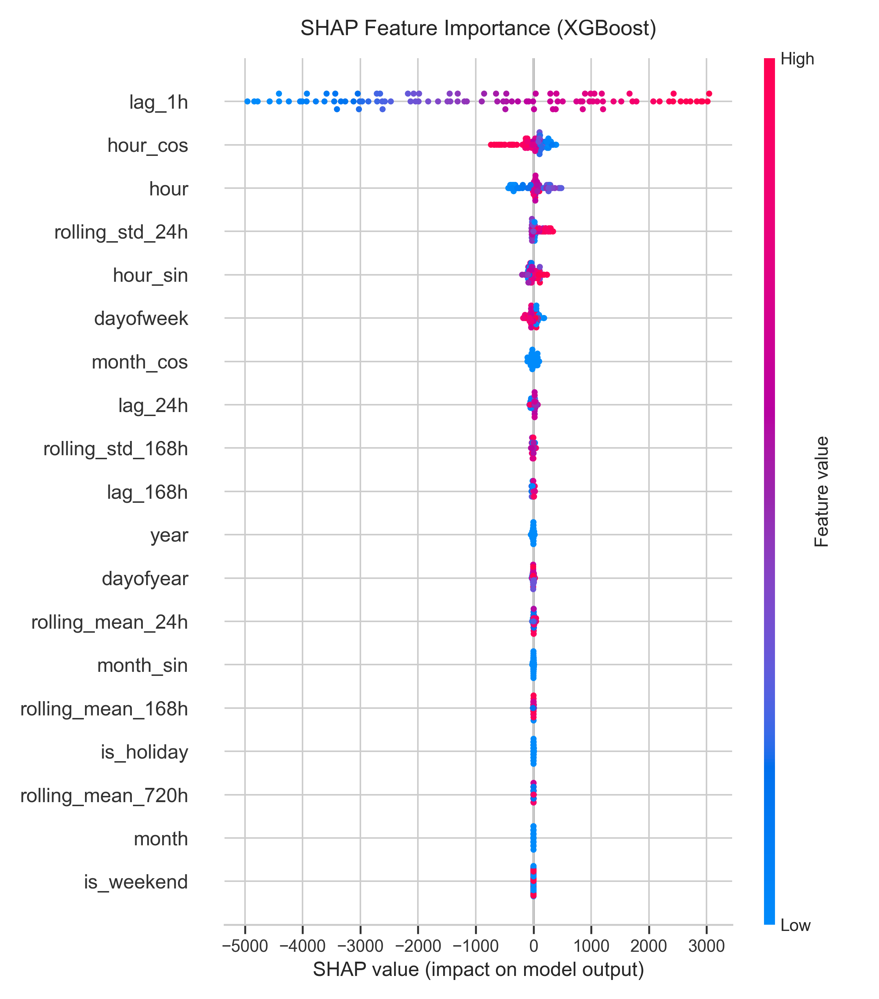

A production-grade time-series system that forecasts hourly electricity
demand on the **PJM Hourly Energy Consumption** dataset, comparing four
modelling approaches from statistical baseline to advanced deep learning.

## Model comparison

Evaluated with **3-fold walk-forward validation** (each test split spanning
30 days of hourly data, no future leakage):

| Model | MAE (MW) | RMSE (MW) | MAPE |
|---|---:|---:|---:|
| Prophet (baseline) | 1,396.96 | 1,769.79 | 9.00% |
| **XGBoost** | **125.09** | **161.94** | **0.81%** |
| LSTM | 170.69 | 222.05 | 1.11% |
| Temporal Fusion Transformer | 896.78 | 1,060.03 | 5.53% |

## Why XGBoost and LSTM win

Electricity load is highly **auto-regressive** — knowing the previous hour's
load makes the next hour highly predictable. XGBoost (0.81% MAPE) and the
LSTM (1.11%) exploit the `lag_1h` feature directly; Prophet captures macro
seasonality but misses sharp hourly deviations, and the TFT underfit under a
restricted 3-epoch budget.

## Feature attribution

The feature pipeline extracts cyclical time encodings, lag features
(1h / 24h / 168h), rolling statistics, and US-holiday flags.

**Stack:** XGBoost · PyTorch (LSTM) · PyTorch Forecasting (TFT) · Prophet · SHAP · pandas
