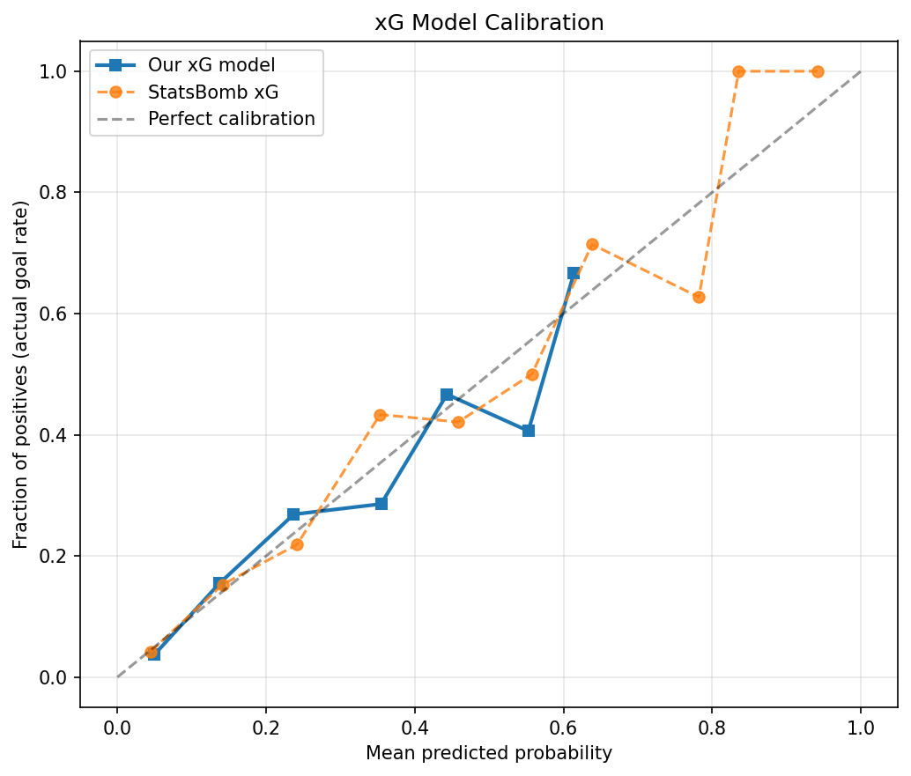
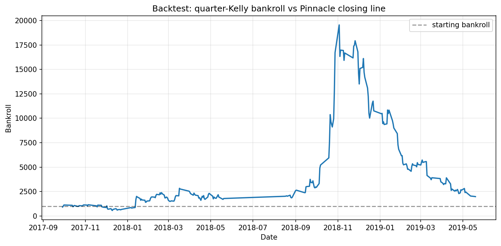
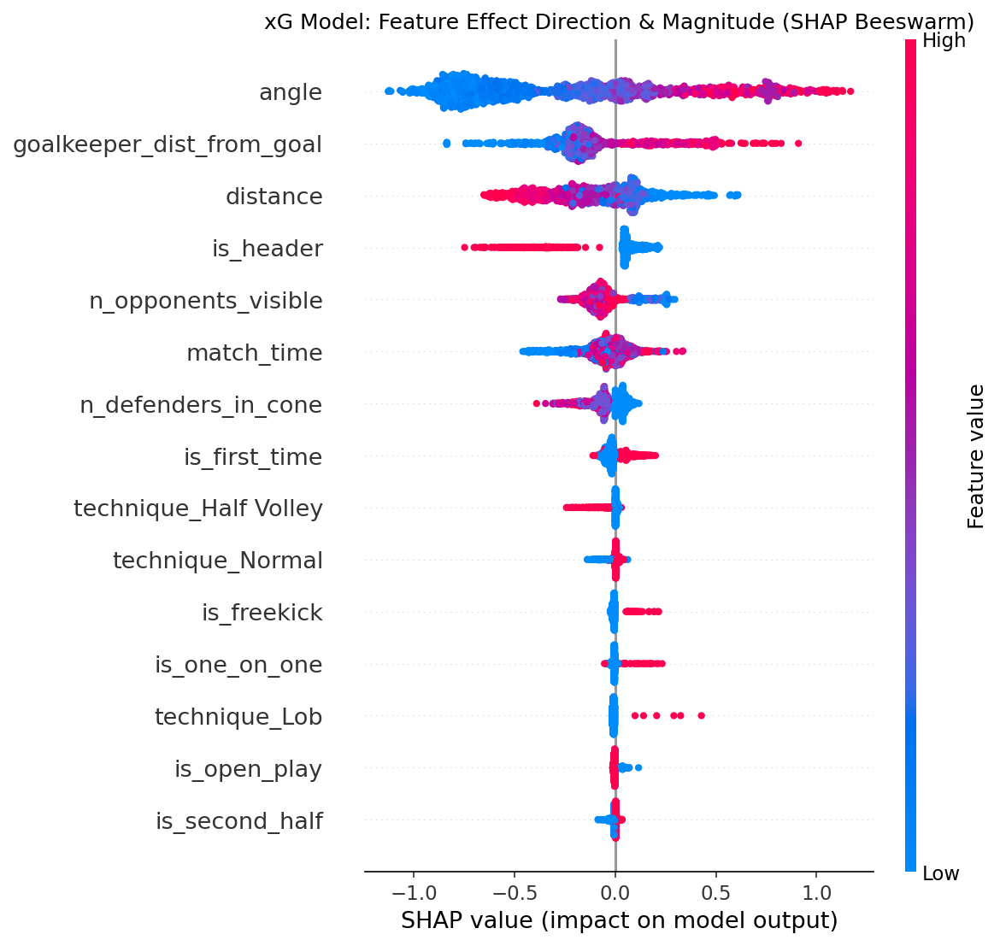

An end-to-end quantitative betting system built around the question that
actually matters in sports modelling: **can a goals-based model beat the
closing line?** The honest answer — demonstrated rigorously rather than
hidden — is *no*, and showing that correctly is the point.

## The result that matters

Walk-forward backtest on **760 La Liga matches (2017–19)**, betting at
**Pinnacle closing odds** (the sharpest available price):

| Metric | Goals model | xG-proxy (shots-on-target) |
|---|---|---|
| Bets placed | 1,379 | 1,636 |
| Level-stakes yield | +5.7% | +3.0% |
| **Yield 95% bootstrap CI** | **[−3.2%, +15.0%]** | **[−4.4%, +10.5%]** |
| Statistically significant? | **No** (p=0.11) | **No** (p=0.22) |

The apparent yield is **not distinguishable from zero**, and the forecast's
Brier score is *worse* than the market's (0.605 vs 0.584) — exactly what
efficient-market theory predicts. The bootstrap CI and Brier-vs-market
comparison are the tools that separate real edge from longshot variance.

## The xG model

XGBoost on StatsBomb shot geometry + freeze-frame defensive context,
**Platt-calibrated** so outputs are usable as true probabilities, and
benchmarked honestly against StatsBomb's own xG (our Brier 0.085 vs their
0.079 — the small gap reflects their proprietary tracking data).

## Walk-forward backtest

Each matchday refits Dixon-Coles team ratings on strictly-prior results
(no look-ahead), simulates the full joint score distribution, flags value
bets vs the closing line, and grades on the actual outcome — reporting a
quarter-Kelly bankroll and max drawdown alongside the yield CI.

## What drives the xG predictions

**Why it matters:** sports-analytics teams live and die by probability
calibration and honest backtesting. Anyone can print a profit on a curated
sample — the valuable skill is knowing that the closing line is the real
bar, and measuring *significance* rather than point estimates.

**Stack:** XGBoost · scikit-learn · SciPy · StatsBombPy · SHAP · Optuna · pytest (37 tests)
