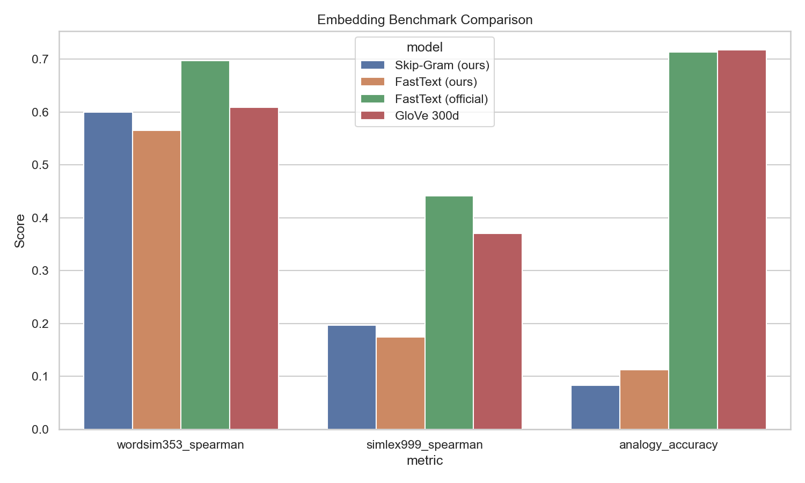
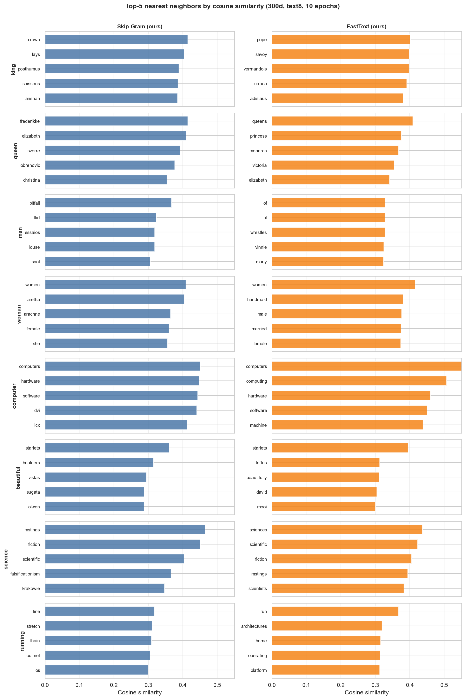

A complete, teaching-grade implementation of **Skip-Gram** and **FastText**
(character n-grams with boundary markers) in PyTorch — built, not
downloaded — trained on text8 and evaluated against official FastText and
GloVe on identical scripts.

## Benchmark (same 300d, 10-epoch budget)

| Model | WordSim-353 ρ | Analogy acc. | Coverage |
|---|---:|---:|---:|
| Skip-Gram (ours) | **0.60** | 8.3% | 99.4% |
| FastText (ours) | 0.56 | **11.3%** | **100%** |
| FastText (official) | 0.70 | 71.3% | 100% |
| GloVe 300d | 0.61 | 71.7% | 100% |

The portfolio claim is **correct implementation and honest interpretation**,
not leaderboard numbers. Our models sit near GloVe on WordSim but trail
official FastText on analogy — and the write-up isolates *why*: corpus
scale (text8 ≈ 17M tokens vs web-scale), not implementation bugs.

## Where subwords actually helped

Not on every scalar — but on **coverage** (100% of WordSim pairs) and
**morphology**: FastText neighbors cluster inflected forms
(`computer → compute, computing`) because character n-grams with `<` `>`
boundaries capture stems and affixes that Skip-Gram can't.

## Learned structure

The full stack is traceable end to end: tokenization → subword hashing
(333k n-grams) → negative sampling → MPS training → `.vec` export → the same
intrinsic benchmarks used for the baselines.

**Stack:** PyTorch (Apple MPS) · Gensim (baselines) · scikit-learn · t-SNE
