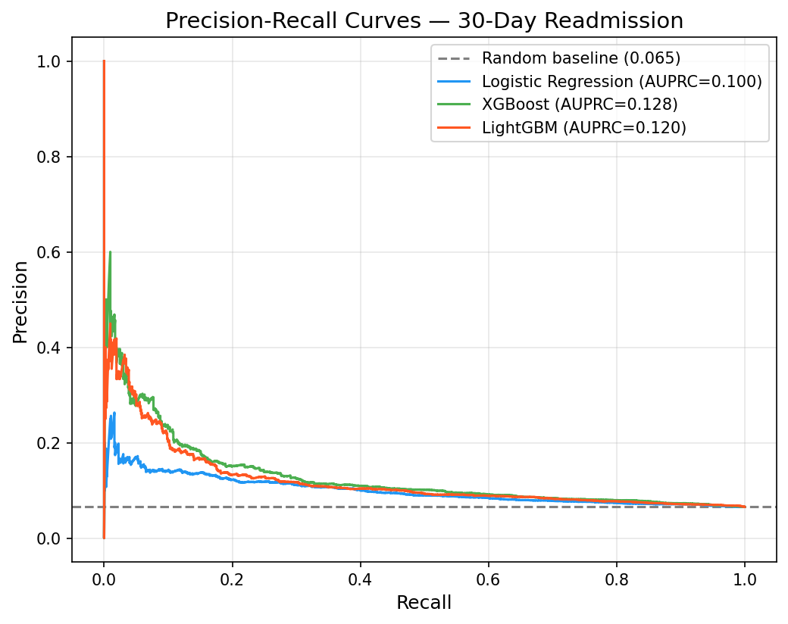
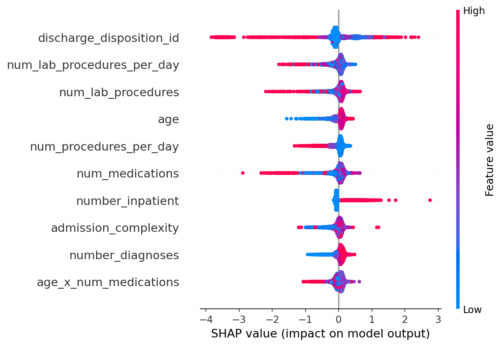

An end-to-end pipeline predicting 30-day hospital readmission for diabetic
patients, built to demonstrate the validation discipline that clinical ML
actually requires.

## Three decisions that matter more than the model

1. **Temporal validation.** A random split leaks future information on
   clinical data. Patients are sorted chronologically and the last 20% held
   out — mirroring real deployment.
2. **AUPRC over AUC-ROC.** With only ~9% readmission, ROC-AUC is overly
   optimistic; AUPRC focuses on the positive class that the business cares
   about.
3. **First-encounter deduplication.** Keeping multiple visits per patient
   violates i.i.d. and inflates performance if a patient lands in both
   train and test.

## Results

| Model | AUPRC | AUROC | F1 |
|---|---:|---:|---:|
| **XGBoost** | **0.128** | **0.634** | **0.168** |
| LightGBM | 0.120 | 0.621 | 0.164 |
| Logistic Regression | 0.100 | 0.603 | 0.150 |

The modest absolute numbers are honest for this notoriously hard,
heavily-imbalanced benchmark — the value is in the methodology, not an
inflated score.

## Clinical transparency with SHAP

Admission complexity, prior admissions, and total medications are the
strongest drivers of predicted readmission risk.

**Stack:** LightGBM · XGBoost · scikit-learn · Optuna · SHAP · SMOTE
